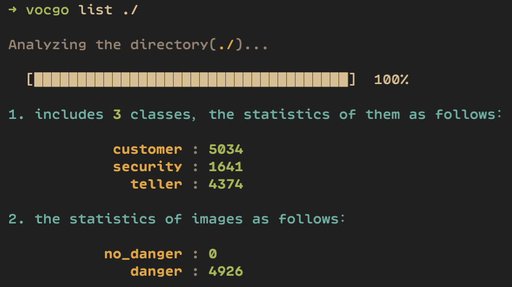
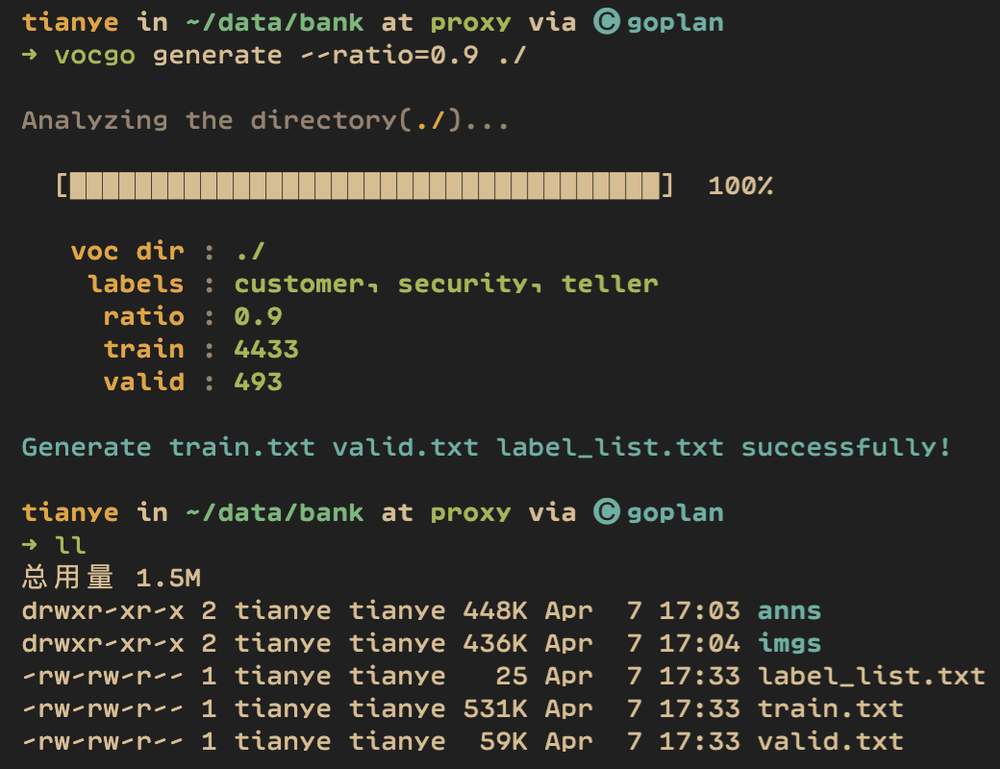

# VOCGO

This is a simple tool for VOC dataset, it can help you analyze and process the dataset, its chinese name is "窝酷狗".

use [poetry](https://python-poetry.org/) to build the package and manage the dependece.

## python 

```
>=python3.6.7
```

## Installing

### pip

```shell
pip install cocogo
```

### poetry

```shell
# clone the Repository
git clone https://github.com/smslit/cocogo.git
# install
cd cocogo && poetry install
```

## Development

execute the follow command after installing poetry:

```shell
# only install the depedence
poetry install --no-root
```

## Usage

```shell
➜ vocgo --help     
Usage: vocgo [OPTIONS] COMMAND [ARGS]...

  This is a simple tool for VOC dataset, it can help you analyze and process
  the dataset, its chinese name is 「窝酷狗」，more details to
  https://github.com/smslit/vocgo

Options:
  --install-completion  Install completion for the current shell.
  --show-completion     Show completion for the current shell, to copy it or
                        customize the installation.

  --help                Show this message and exit.

Commands:
  generate  generate the train files for model training and evaluating
  list      analyze the dataset and display the statistics
  version   display the version info
```

### list

The subcommand can analyze the specified VOC dataset and display the statistics data.

For example:

```shell
vocgo list ./
```



### generate

This subcommad can help prepare the data files(train.txt valid.txt label_list.txt) based on anns and imgs data.

For example:


